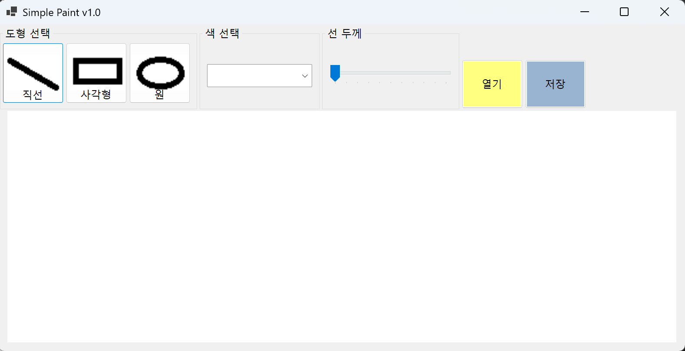
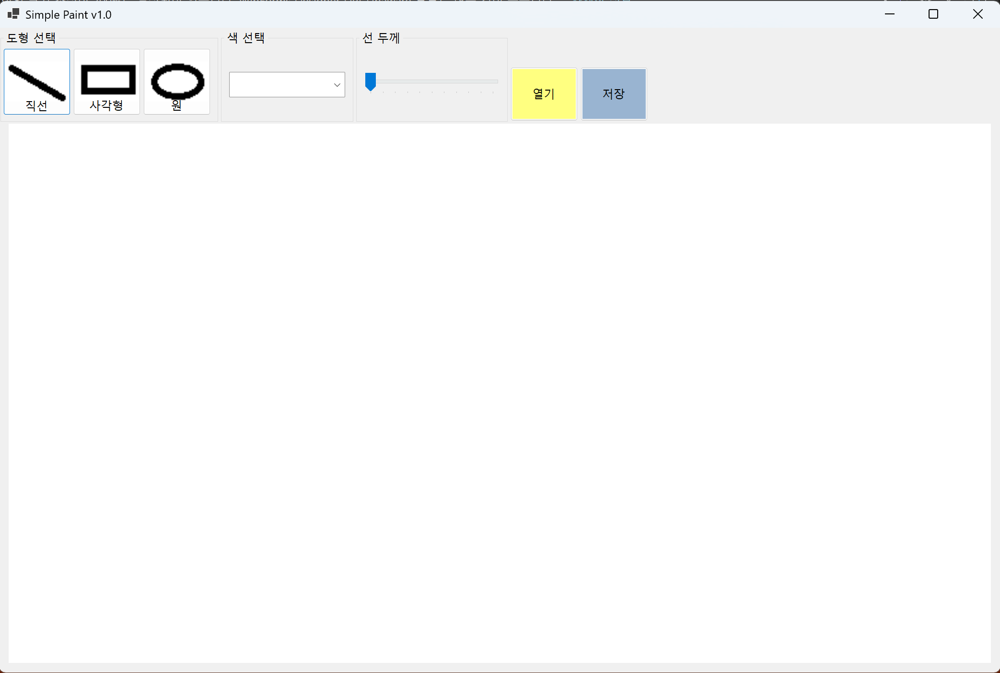

(C# 코딩) 그림판 (Simple Paint)
## 개요
- C# 프로그래밍 학습
- 1줄 소개: 사용자가 선택한 도형을 그릴 수 있는 Windows Forms 기반 프로그램
- 사용한 플랫폼:
	- C#, .NET Windows Forms, Visual Studio, GitHub
- 사용한 컨트롤:

	- Label → 프로그램 제목(Simple Paint)을 표시하여 사용자에게 프로그램의 목적을 직관적으로 전달한다.
	- GroupBox → 도형 선택, 색 선택, 선 두께 등의 기능을 영역별로 구분하여 UI를 구조적으로 정리하고 사용자가 기능을 쉽게 인식할 수 있도록 한다.
	- Button → 직선, 사각형, 원 도형 선택 및 파일 열기/저장 기능을 수행하며, 사용자 입력을 통해 프로그램의 주요 동작을 실행하는 역할을 한다.
	- ComboBox → 색상을 선택할 수 있도록 하여 사용자가 원하는 색으로 도형을 그릴 수 있게 한다.
	- TrackBar → 선의 두께를 조절하는 기능을 제공하여 사용자에게 다양한 표현 옵션을 제공한다.
	- PictureBox → 그림을 그리는 캔버스 역할을 하며, 사용자의 마우스 입력을 기반으로 도형을 출력하는 영역으로 사용된다.
	- Panel → 상단 메뉴 영역(panelTop)과 그림 영역(panelMain)을 구분하여 레이아웃을 구성하고, 창 크기 변경 시에도 UI가 유동적으로 유지되도록 한다.

- 사용한 기술과 구현한 기능
	- Visual Studio를 이용하여 Simple Paint 프로그램의 기본 UI를 구성함
	- Panel과 Dock 속성을 활용하여 창 크기 변경 시에도 UI가 유동적으로 유지되도록 구현함
	- PictureBox를 활용하여 그림을 그릴 수 있는 캔버스 영역을 구성함
	- MouseDown, MouseMove, MouseUp 이벤트를 사용하여 마우스 드래그 기반의 도형 그리기 기능을 구현함
	- Graphics와 Bitmap 객체를 사용하여 직선, 사각형, 원 도형을 화면에 출력하고 유지되도록 처리함
	- Button 클릭 이벤트를 활용하여 직선, 사각형, 원 도형 선택 기능을 구현함
	- ComboBox와 Color 클래스를 사용하여 색상 선택 기능을 구현함
	- TrackBar의 Scroll 이벤트를 활용하여 선의 두께를 조절하는 기능을 구현함
## 실행 화면 (과제1)
- 코드의 실행 스크린샷과 구현 내용 설명

	- 초기화면

- 코드의 실행 스크린샷과 구현 내용 설명

	- anchor 설정을 통해 창 크기 변경 시에도 UI가 유동적으로 유지되도록 구현
	- dock 설정을 통해 창 크기 변경 시에도 UI가 유동적으로 유지되도록 구현
	- panelTop과 panelMain을 사용하여 상단 메뉴와 그림 영역을 구분하고, 창 크기 변경 시에도 UI가 유동적으로 유지되도록 구현
	- 윈도우 제공 그림판처럼 도화지 역할을 하는 PictureBox 컨트롤을 사용하여 그림을 그리는 영역의 크기를 조절하고, 창 크기 변경 시에도 UI가 유동적으로 유지되도록 구현
	

- 과제 내용
	- 기본 ui구성 
	- 간단한 그림판(Canvas) 영역 구성

- 구현 내용과 기능 설명
	- 프로그램의 기본 UI를 구성하여 도형 선택, 색상 선택, 선 두께 조절 등 기능을 직관적으로 사용할 수 있도록 설계하였다.
	- 버튼을 통해 직선, 사각형, 원 도형을 선택할 수 있도록 구현하였다.
	- ComboBox를 활용하여 색상을 선택하고, TrackBar를 통해 선의 두께를 조절할 수 있도록 하였다.
	- PictureBox를 캔버스로 사용하여 그림을 그릴 수 있는 영역을 구성하였다.
	